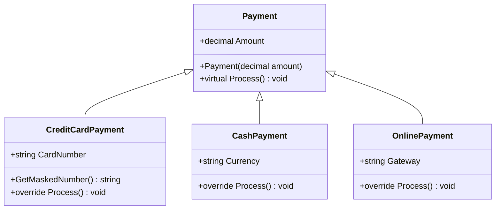

# Лабораторна робота №5. Поліморфізм: динамічне зв'язування та перевизначення методів

**Дисципліна:** Об'єктно-орієнтоване програмування (C#)
**Варіант:** 14 — Поліморфні платежі

---

## Мета

Навчитися реалізовувати поліморфну поведінку за допомогою віртуальних методів та їх перевизначення, а також агрегувати результати поліморфних викликів.

## Реалізована ієрархія

| Клас | Поля | Що робить `Process()` |
|---|---|---|
| `Payment` (базовий) | `Amount` | `virtual`: загальна обробка платежу |
| `CreditCardPayment` | `CardNumber` | `override`: списує суму з картки, номер виводить у масці `**** **** **** 1234` |
| `CashPayment` | `Currency` | `override`: приймає готівку у вказаній валюті, видає чек |
| `OnlinePayment` | `Gateway` | `override`: передає платіж до платіжного шлюзу |

Кожен клас має конструктор, який ініціалізує свої поля та перевіряє вхідні дані (додатна сума, непорожні рядки, 16 цифр у номері картки). Похідні конструктори викликають `base(amount)`.

## Демонстрація поліморфізму

У `Main` створюється `List<Payment>`, до якого додаються по два об'єкти кожного з трьох похідних класів. Цикл викликає `payment.Process()` для кожного елемента через посилання базового типу `Payment`, а CLR під час виконання обирає реалізацію за фактичним типом об'єкта.

Агрегація (метод `CalculateTotal` та `Max`/`Min`): кількість платежів, **загальна сума всіх платежів**, найбільший і найменший платіж.

## Приклад роботи програми

Перевірка суми: 1250.50 + 300.00 + 780.25 + 99.99 + 150.00 + 420.00 = 3000.74.

## Висновки

1. Віртуальні методи дозволяють працювати з різними видами платежів однаково: цикл у `Main` не знає, який саме перед ним платіж, але кожен об'єкт виконує власну логіку `Process()`.
2. Модифікатор `virtual` у базовому класі дозволяє, а `override` у похідному — реалізує заміну поведінки. Без `override` (наприклад, з `new`) виклик через посилання базового типу виконав би базову версію.
3. Колекція `List<Payment>` дає змогу агрегувати дані єдиним кодом: суму, максимум і мінімум обчислено через властивість `Amount` базового класу, незалежно від типу платежу.
4. Код легко розширювати: новий спосіб оплати (наприклад, `CryptoPayment`) — це новий похідний клас з `override Process()`, а `Main` та агрегація не змінюються (принцип відкритості/закритості, OCP).
5. Конструктори перевіряють вхідні дані, тому некоректний об'єкт (від'ємна сума, порожній шлюз) створити неможливо, а номер картки виводиться лише в масці.

## Відповіді на контрольні питання

**1. Що таке поліморфізм і як він реалізується в C# за допомогою `virtual` та `override`?**
Поліморфізм — це здатність об'єктів різних класів по-різному реагувати на однаковий виклик методу залежно від їхнього фактичного типу. У C# базовий клас позначає метод як `virtual`, а похідний клас надає власну реалізацію з `override`. У цій роботі `Payment.Process()` — `virtual`, а `CreditCardPayment`, `CashPayment` і `OnlinePayment` його перевизначають.

**2. Поясніть поняття динамічного зв'язування. Чим воно відрізняється від статичного?**
Динамічне (пізнє) зв'язування — вибір конкретної реалізації методу під час виконання програми за фактичним типом об'єкта (через таблицю віртуальних методів). Статичне (раннє) зв'язування відбувається під час компіляції за оголошеним типом змінної: так працюють звичайні (не віртуальні) методи, перевантаження та приховування через `new`. Для змінної `Payment payment = new CashPayment(...)` виклик `payment.Process()` буде динамічним, тому виконається версія з `CashPayment`.

**3. Наведіть приклад, як поліморфізм дозволяє писати більш гнучкий та розширюваний код.**
Якщо додати клас `CryptoPayment : Payment` з власним `override Process()`, його можна одразу покласти в `List<Payment>`, і цикл обробки та підрахунок суми працюватимуть без жодних змін. Без поліморфізму довелося б у кожному такому місці дописувати `if`/`switch` за типом платежу.

**4. Які переваги дає використання колекцій базових типів для роботи з поліморфними об'єктами?**
Одна колекція зберігає об'єкти різних похідних типів, а один цикл обробляє їх усі. Код залежить від абстракції (`Payment`), а не від конкретних класів, тож його менше і він простіший у підтримці. Нові типи додаються без змін у коді, що працює з колекцією, а агрегація використовує спільні члени базового класу (`Amount`).
